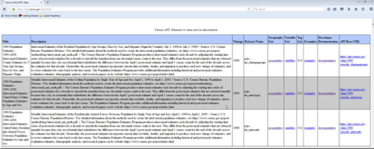
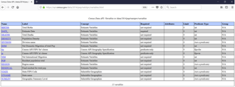
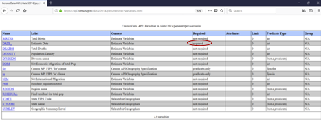
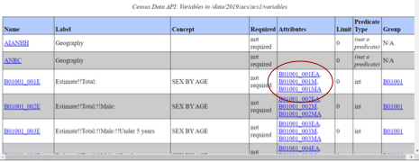
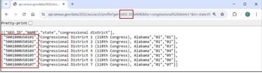
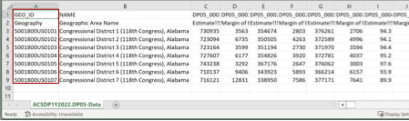

# Census Data API User Guide

## Purpose

The purpose of this user guide is to instruct developers and researchers on how to use the Census Data Application Programming Interface (API) to request data from U.S. Census Bureau datasets.

Applications built on Census data typically take advantage of three underlying services: Census Data API, TIGERweb REST Services and the Geocoder REST Services:

### Census Data API

The [Census Data Application Programming Interface (API)](https://www.census.gov/data/developers/updates/new-discovery-tool.html) is an API that gives the public access to raw statistical data from various Census Bureau data programs. In terms of space, we aggregate the data and usually associate them with a certain Census geographic boundary/area
defined by a FIPS code. In terms of time, we associate the data with a specific vintage (reference year).

### TIGERweb

[TIGERweb GeoServices REST API](https://www.census.gov/data/developers/data-sets/TIGERweb-map-service.html) provides Census area boundaries/shapes referenced by FIPS codes. This service can take two types of parameters to return one or more Census boundaries: a FIPS code or a latitude/longitude pair. FIPS codes are 12-digit codes that are hierarchical in code so that the higher numbers define higher-level geographies and lower numbers define lower-level geographies.

### Geocoder

Our publicly available [Geocoding Services API](https://www.census.gov/data/developers/data-sets/Geocoding-services.html) translates addresses and other location formats into latitude/longitude parameters, which are then fed into the TIGERweb REST services to request a Census boundary.

### Focus: Census Data API

The primary purpose of this guide is to cover the Census Data API. To learn more about the geography APIs, please visit the links included above.

## What is the Census Data API?

[The Census Data Application Programming Interface (API)](https://www.census.gov/data/developers/updates/new-discovery-tool.html) is a data service that enables software developers to access and use Census Bureau data within their applications.

Researchers and software developers both inside and outside the Census Bureau use this API. Its simple raw format provides greater ease and accessibility for inputting data to whatever format you need for presenting and manipulating these data. The Census Data API is an efficient way to query data directly from Census Bureau servers with many advantages:

- No complex interface
- Continual accessibility eliminates need to host data on own server
- Easily downloads target variables and geographies
- Connects to statistical software like R and SAS
- Provides immediate access to most current data
- Facilitates building new mobile and Web applications
- Drives interactive data visualizations

## Available Datasets

Determine the dataset that holds the information for which you are searching. Then decide what information you want from this dataset. The Census Bureau has already made available many datasets and is adding more almost monthly for querying with the API tool. Currently, the most popular aggregate datasets to query for variables using the API are as follows:
- American Community Survey (ACS): ACS 1-Year, ACS 5-Year, ACS Supplemental, ACS Migration Flows
- Economic Indicators Time Series
- Decennial Census
- Economic Census
- County Business Patterns and Nonemployer Statistics
- Population Estimates and Projections
- International Trade

You can find a complete list of available datasets in the [API Discovery Tool](https://api.census.gov/data.html).



*Figure 1 Datasets in the Census Data API: https://api.census.gov/data.html*

## Core Concepts

Below are the terms you will need to be familiar with when running an API query, like this one for the dataset, Vintage 2014 Population Estimates: US, State, and PR Total Population and Components of Change (Use Firefox or Chrome):

https://api.census.gov/data/2014/pep/natstprc?get=STNAME,POP&DATE_=7&for=state:*

> **Tip**: We recommend that you use Chrome or Firefox when building and running API queries.

### Variables

A variable is each unit of data you are searching for in a dataset. Each variable that you can search for in a dataset has a name, which may be an acronym or meaningful on its own; e.g., STNAME, POP, DATE_.

In larger datasets, such as the American Community Survey, many of these names are based on an alphanumeric code; e.g., B01003_001E (Total Population).

You can find the list of variables in the dataset by visiting the variables page. For example, the [variables page for the Vintage 2014 Population Estimates: US, State, and PR Total Population and Components of Change](https://api.census.gov/data/2014/pep/natstprc/variables.html).



*Figure 2: Variable Table for 2014 Population Estimates: US, State, and PR Total Population and Components of Change*

You can include up to 50 variables in the same API call, separated by commas.

### Required Variables

Most of the time, you have the option to choose the variables you want to include in your API call, but occasionally some datasets have required variables. Required variables are the parameters that you need to include in your search; otherwise, your search will produce no data and will return an error message. The variable table for each dataset lists which variables are required, as shown below in the variables page for the [2014 Population Estimates (Total and Components of Change) Dataset](https://api.census.gov/data/2014/pep/natstprc/variables.html).



*Figure 3: Variable Table for 2014 Population Estimates: US, State, and PR Total Population and Components of Change*

### Attributes

Attributes are additional variables you can include in your API call that give more information for the primary variable. For instance, they may provide labels, annotations, notes, margins of error, statistical significance, or flags that are related to your primary variable.

Attributes are available in many datasets and you can explore them in the discovery tool. For example, in the [2019 American Community Survey 1-Year dataset](https://api.census.gov/data/2019/acs/acs1/variables.html), you can see variables listed in the Attributes column of the discovery tool (shown below).



*Figure 4: Attributes for 2019 ACS 1-Year Estimates*

### Get Function

The get function (get=) specifies the required and selected variables you are requesting the API to give you. For example (use Chrome or Firefox):

https://api.census.gov/data/2014/pep/natstprc?get=STNAME,POP&DATE_=7&for=state:*

### Predicate

The predicate specifies how variables should be filtered or limited, and you can create predicates of geography, string variables, numeric variables, and time (in time series datasets).

In this example, the predicate limits the search on the July 1, 2014 (&DATE_=7) population or housing unit estimate and for all states (&for=state:*):

https://api.census.gov/data/2014/pep/natstprc?get=STNAME,POP&DATE_=7&for=state:*

**Please note**:

- Predicates always start with an ampersand (&).
- A wildcard (:*) can be included to search for all the values of a variable. Wildcards work for geographies and string variables only.
- A variable only needs to appear once in a query ̶either in the get statement or as a predicate. In the example above, DATE_ is a predicate (&DATE_=7), so you do not need to include it in the get statement (?get=STATENAME,POP).

Below are some examples of predicates that you can use as a guide when building your queries.

***Geography***

The predicate ***&for*** restricts the variables by geography at various levels, while ***&in*** and **%20** restricts to geographic areas smaller than state level. You can include wildcards (*) along with **&for** and **&in**.

Examples to get results for a single geography:

- &for=state:01 – restricts the result to include only Alabama
-  &for=county:001&in=state:01 – restricts the result to include only Autauga County, Alabama
- &for=county%20(or%20part):073&in=state:01%20place:07000 – restricts the result to include the portion of Jefferson County (county:073), Alabama that is within Birmingham city (place:07000)

Examples to get results for multiple geographies:
- &for=state:01,13 – retrieves the result for Alabama and Georgia
- &for=state:* – retrieves the result for all states
- &for=county:*&in=state:01 – restricts the result to include all counties in Alabama
- &for=county%20(or%20part):*&in=state:01%20place:62328 – restricts the result to include all counties within Prattville city (place: 62328), Alabama

> **Tip**: The “Examples” pages in the discovery tool will list the available geographic levels and predicates for your dataset so you don’t have to build these from scratch.

For more information on Census Bureau geography, visit the [Geography webpage](https://www.census.gov/programs-surveys/geography.html).

As an alternative, you may instead use &ucgid to restrict your variables by geography. For more details, see the [Ucgid Predicate](#ucgid-predicate-alternative-option-to-specify-geographies) section of this guide.

***Variables – String***

You can create a predicate of string variables with various restrictions and can include wildcards (*). Below are several examples across different surveys and programs.

Examples to get results for a single variable value:

- &AGEGROUP=29 – restricts results to include data for people age 18 years and over (example: [2019 Population Estimates Program Characteristics of Age Groups](https://api.census.gov/data/2019/pep/charagegroups.html))
- &POPGROUP=400 – restricts results to include data for POPGROUP code 400, which corresponds to the Hispanic or Latino population (example: [2019 ACS 1-Year Selected Population Profiles](https://api.census.gov/data/2019/acs/acs1/spp.html)
- &GEOCOMP=A0 – restricts results to include data for the portion of your geography that is within a metropolitan/micropolitan statistical area (example: [2018 ACS 5-year Data Profiles](https://api.census.gov/data/2019/acs/acs1/spp.html))
- &PORT=0101 – restricts the result to include data for PORT code 0101, which corresponds to Portland, ME (example: [International Trade – U.S. Exports by Port and Harmonized System](https://api.census.gov/data/timeseries/intltrade/exports/porths.html))

Examples to get results for multiple variable values:

- &POPGROUP=400&POPGROUP=451 – restricts results to include data for POPGROUP codes 400 and 451, which are the codes for the Hispanic or Latino and Non-Hispanic white alone populations (example: [2019 ACS 1-Year Selected Population Profiles}(https://api.census.gov/data/2019/acs/acs1/spp.html))
- &PORT=0101&PORT=0501 – restricts the result to include only ports with PORT codes 0101 and 0501 which correspond to Portland, ME and Newport, RI (example: [International Trade – U.S. Exports by Port and Harmonized System](https://api.census.gov/data/timeseries/intltrade/exports/porths.html))
- &PORT=21* – restricts the result to include data for PORT codes starting with 21 which may include but is not limited to 2101, 2102, 2103, and 2104, etc. (example: [International Trade – U.S. Exports by Port and Harmonized System](https://api.census.gov/data/timeseries/intltrade/exports/porths.html))
- &NAICS2017=23* -- restricts results to include data for all available NAICS codes that begin with 23 in the construction sector (example: [2018 County Business Patterns](https://api.census.gov/data/2018/cbp.html))

> **Tip**: You can use wildcards (*) in predicates with string variables and geographies only. You cannot use wildcards in time predicates or predicates with numeric variables.

***Variables – Numeric (Integer and Float)***

You can create a predicate of a range of values for numeric (integer and float) variables. Please note that you cannot build a predicate with wildcards for numeric variables.

Examples from County Business Patterns and the American Community Survey:
- &PAYANN=100000 – restricts the result to include data where annual payroll is equal to 100,000
- &PAYANN=200000&PAYANN=300000 – restricts the result to include data where annual payroll is equal to 200,000 or 300,000
- &PAYANN=0:399999 – restricts the result to include data with annual payroll less than 400,000
- &PAYANN=400000:500000 – restricts the result to include data where annual payroll is from 400,000 to 500,000
- &DP05_0001E=100000:999999 – restricts results to include data where total population is from 100,000 to 999,999
- &DP03_0128PE=0:20 – restricts results to include data where the percent of people in poverty is from 0% to 20%

> **Tip**: You can use colons (:) to restrict results by a range of variable values for integer and float variables only. You cannot use colons with string variables.

***Time (Time Series Datasets Only)***

For some datasets available on the Census Data API, data are stored for multiple points of time in one dataset, rather than across several datasets for individual points of time. When this occurs, we refer to the dataset as a time series dataset. You can find the list of time series datasets in the [time series section of the API Discovery Tool](https://api.census.gov/data/timeseries.html).

You can limit by time in most time series datasets by using the predicate &time. Please note that you cannot build a predicate with wildcards (*) for time in a time series dataset. The plus sign (+) is needed for time ranges, such as the time range from 1997 to 2012 (below).

Examples:
- &time=2015 – restricts the result to include data for 2015
- &time=from+1997+to+2012 – restricts the result to include data from 1997 to 2012
- &time=2015-01 – restricts the result to include data for January, 2015
- &time=2015-Q1 – restricts the result to include data for the first quarter of 2015
- &time=from+2015-01 – restricts the result to include data from January, 2015 to the present
- &time=to+2015-01 – restricts the result to include data up to January, 2015
- &time=from+2015-01+to+2015-06 – restricts the result to include data from January, 2015 to June, 2015

Some time series datasets do not include the variable “time.” Instead, they use other variables such as “Year.” For these time-related variables, check the predicate type in the discovery tool to find out whether you can filter it following the guidelines for string or numeric variables described earlier in this document.

For more information about time series datasets, see the Time Series Dataset Example – International Trade Monthly Exports section of this user guide.

### Response Format –JSON

The results from your Census Data API data queries will return in JavaScript Object Notation (JSON) format, and you can easily plug those data into the formatting file or graphic of your choice. JSON is an easy format for exchanging data between platforms using human-readable language, rivaling the popularity of XML. The Census uses a nonstandard version of JSON that is streamlined:
- Data are represented in a two-dimensional array
- Square brackets [ ] hold arrays
- Values are separated by a , (comma).

```json
[["STNAME","POP","DATE_","state"],
["Alabama","4849377","7","01"],
["Alaska","736732","7","02"],
["Arizona","6731484","7","04"],
["Arkansas","2966369","7","05"],
["California","38802500","7","06"],
…..
```

### Group Function

The group function group([insert table ID]) allows you to get results for an entire table in one easy command; e.g. group(S0101). It provides results for all variables without having to individually include them in the API call. Even if the table has more than 50 variables, the group call will provide results for all variables in that table.

For example, this API query provides results for all 912 variables for table S0101 from the American Community Survey
https://api.census.gov/data/2019/acs/acs1/subject?get=group(S0101)&for=state:*

## Example API Queries

Following are some examples that give a detailed breakdown of the components of the URL needed for building a query in a dataset. These examples will introduce you to some of the most popular datasets in the API: Population Estimates, the American Community Survey, and International Trade. Many aspects of these examples apply across datasets, such as the use of categorical variables or group calls.

### Population Estimates Example

Let’s begin with a query for the Hispanic population by state in the dataset, *Population Estimates: Estimates by Age Group, Sex, Race, and Hispanic Origin*. You will find this dataset listed on the Census Data API [Datasets page](https://api.census.gov/data.html) of the Discovery Tool:

Format queries as a URL, as follows (use Chrome or Firefox):
https://api.census.gov/data/2019/pep/charagegroups?get=NAME,POP&HISP=2&for=state:*

Assemble components of this query by following these steps:
1. Start your query with the host name:
https://api.census.gov/data
2. Add the data year to the URL:
https://api.census.gov/data/2019
This is the year that the data were estimated.
3. Add the dataset name acronym:
https://api.census.gov/data/2019/pep/charagegroups
This is the base URL for this dataset. You can find dataset names by browsing the
discovery tool: https://api.census.gov/data.html
4. Add ?get= to the query
https://api.census.gov/data/2019/pep/charagegroups?get=
5. Add your variables:
https://api.census.gov/data/2019/pep/charagegroups?get=NAME,POP

   In this dataset, NAME will provide the geography name and POP will provide the total population. Use a comma to separate each variable; e.g., NAME,POP. You can find the full list of available variables in the variables page for the dataset:
https://api.census.gov/data/2019/pep/charagegroups/variables.html.

6. Add variable predicates (if applicable):
https://api.census.gov/data/2019/pep/charagegroups?get=NAME,POP&HISP=2

   In this dataset, the variable HISP provides data for three categories:
   - 2 = Hispanic
   - 1 = Non Hispanic
   - 0 = Total Population
   
   You can find this by clicking the link for the [HISP variable](https://api.census.gov/data/2019/pep/charagegroups/variables/HISP.json) in the discovery tool, or by visiting the [documentation page for categorical variables in the Population Estimates datasets](https://www.census.gov/data/developers/data-sets/popest-popproj/popest/popest-vars.Vintage_2019.html).

7. Add your geographies:
https://api.census.gov/data/2019/pep/charagegroups?get=NAME,POP&HISP=2&for=state:*

   Use a predicate clause starting with an ampersand (&) to separate it from your get clause and then a for followed by an in clause, if needed; e.g., &for=state:. Because we are looking for information in all the states, add a wildcard (*) to indicate all values; e.g., state:*. You can find the full list of available geographies in the examples page for the dataset: https://api.census.gov/data/2019/pep/charagegroups/examples.html

   As you can see, you can only search on the state, county, or national level for this dataset. Other datasets provide results for more types of geographic areas. Sometimes datasets change the number of geographies they publish from year to year.

You can copy your query results into a spreadsheet to clean it up and analyze it, or you can save it as a file and consume it as JSON. The response for all queries is formatted as a two dimensional JSON array where the first row provides column names and the subsequent rows provide data values. The first rows of output of the query are configured as follows:

```json
[["NAME","POP","HISP","state"],
["Mississippi","100110","2","28"],
["Missouri","268708","2","29"],
["Montana","43289","2","30"],
["Nebraska","219645","2","31"],
["Nevada","900600","2","32"],
["New Hampshire","54589","2","33"],
["New Jersey","1856844","2","34"],
["New Mexico","1032942","2","35"],
["New York","3751058","2","36"],
…..
```

You can find examples of other queries for this dataset by clicking the link in the Examples column on the API datasets page, which takes you to this Example page:
https://api.census.gov/data/2019/pep/charagegroups/examples.html

> **Tip**: As you begin to build queries, start with examples and expand upon them. This is a great way to learn how to use the Census Data API.

### American Community Survey (ACS) Example

The ACS has many datasets in the Census Data API with a large number of variables and special naming conventions. In our example, we will focus on the American Community Survey 1-Year Data.

***E and M***

At the end of a variable’s name in ACS datasets, E and M are characters for estimates and margins of error. E indicates the estimated value, based on the sample surveyed, while M at the end of a variable number indicates the margin of error. The smaller the sample size the greater
the margin of error.

***PE and PM***

At the end of a variable’s name in some ACS datasets, PE stands for percentage estimate, and PM stands for percentage margin of error.

More details are available on the [ACS Variable Types page](https://www.census.gov/data/developers/data-sets/acs-1year/notes-on-acs-api-variable-types.html).

In our example, we will build an API call that provides data for the total number of Hmong people living in each U.S. state as determined by the 2019 American Community Survey 1-Year data. Format the search query URL as follows:

https://api.census.gov/data/2019/acs/acs1?get=NAME,B02015_009E,B02015_009M&for=state:*

Assemble components of this query by following these steps:
1. Start your query with the host name:
https://api.census.gov/data
2. Add the data year to the query:
https://api.census.gov/data/2019
3. Add the dataset name acronym:
https://api.census.gov/data/2019/acs/acs1

   This is the base URL for this dataset. You can find dataset names by browsing the discovery tool: https://api.census.gov/data.html

4. Add ?get= to the query:
https://api.census.gov/data/2019/acs/acs1?get=
5. Add your variables:
https://api.census.gov/data/2019/acs/acs1?get=NAME,B02015_009E,B02015_009M

   In this dataset, the variable called NAME provides the geographic name you are using to limit your search. The variable B02015_009E provides the total number of Hmong people, and the variable B02015_009M is an attribute that will provide the corresponding margin of error. Use a comma to separate each variable; e.g.,?get=NAME,B02015_009E,B02015_009M. You can find the full list of available variables in the variables page for the dataset: https://api.census.gov/data/2019/acs/acs1/variables.html.

6. Add your geographies:
https://api.census.gov/data/2019/acs/acs1?get=NAME,B02015_009E,B02015_009M&for=state:*

   Use a predicate clause starting with an ampersand (&) to separate it from your get clause and then a for followed by an in clause, if needed; e.g., &for=state:. Because we are looking for information in all the states, add a wildcard (*) to indicate all values; e.g., state:*. You can find the full list of available geographies in the examples page for the dataset: https://api.census.gov/data/2019/acs/acs1/examples.html

The query configures the first rows of output as follows:

```json
[["NAME","B02015_009E","B02015_009M","state"],
["Illinois","655","511","17"],
["Georgia","3162","1336","13"],
["Idaho",null,null,"16"],
["Hawaii","56","92","15"],
["Indiana","1344","1198","18"],
["Iowa","685","705","19"],
["Kansas","2189","1177","20"],
["Kentucky","530","503","21"],
["Louisiana","0","224","22"],
["Maine",null,null,"23"],
…..
```

“Null” occurs as a result when there is no data entered for that answer. You can find other examples of searches in this dataset by clicking the link in the “Examples” column on the API datasets page, which will take you to the examples page here:

https://api.census.gov/data/2019/acs/acs1/examples.html

> **Tip:** If your query returns an error message with no data, check your spelling, capitalization, and spacing. Correct it, and run it again.

### Group Call Example – Get Results for All Data Variables in a Table

If you want data for all variables in a table, use the group functionality. This will give you results for all variables in one easy command, even if the table contains more than 50 variables. For example, this API query provides results for all variables in table B02015 in each state from the 2019 American Community Survey 1-Year Estimates

https://api.census.gov/data/2019/acs/acs1?get=group(B02015)&for=state:*

Assemble components of this query by following these steps:
1. Start your query with the host name:
https://api.census.gov/data
2. Add the data year to the query:
https://api.census.gov/data/2019
3. Add the dataset name acronym:
https://api.census.gov/data/2019/acs/acs1

   This is the base URL for this dataset. You can find dataset names by browsing the discovery tool: https://api.census.gov/data.html

4. Add ?get= to the query:
https://api.census.gov/data/2019/acs/acs1?get=
5. Add group and your desired table ID in parenthesis.
https://api.census.gov/data/2019/acs/acs1?get=group(B02015)
6. Add your geographies:
https://api.census.gov/data/2019/acs/acs1?get=group(B02015)&for=state:*

   Use a predicate clause starting with an ampersand (&) to separate it from your get clause and then a for followed by an in clause, if needed; e.g., &for=state:. Because we are looking for information in all the states, add a wildcard (*) to indicate all values; e.g.,**state**:*. You can find the full list of available geographies in the examples page for the dataset: https://api.census.gov/data/2019/acs/acs1/examples.html

The query provides the first rows of output as follows:
```json
[["B02015_001E","B02015_001EA","B02015_001M","B02015_001MA","B02015_002E","B02015_002EA","B02015_002M","B02015_002MA","B02015_003E","B02015_003EA","B02015_003M","B02015_003MA","B02015_004E","B02015_004EA","B02015_004M","B02015_004MA","B02015_005E","B02015_005EA","B02015_005M","B02015_005MA","B02015_006E","B02015_006EA","B02015_006M","B02015_006MA","B02015_007E","B02015_007EA","B02015_007M","B02015_007MA","B02015_008E","B02015_008EA","B02015_008M","B02015_008MA","B02015_009E","B02015_009EA","B02015_009M","B02015_009MA","B02015_010E","B02015_010EA","B02015_010M","B02015_010MA","B02015_011E","B02015_011EA","B02015_011M","B02015_011MA","B02015_012E","B02015_012EA","B02015_012M","B02015_012MA","B02015_013E","B02015_013EA","B02015_013M","B02015_013MA","B02015_014E","B02015_014EA","B02015_014M","B02015_014MA","B02015_015E","B02015_015EA","B02015_015M","B02015_015MA","B02015_016E","B02015_016EA","B02015_016M","B02015_016MA","B02015_017E","B02015_017EA","B02015_017M","B02015_017MA","B02015_018E","B02015_018EA","B02015_018M","B02015_018MA","B02015_019E","B02015_019EA","B02015_019M","B02015_019MA","B02015_020E","B02015_020EA","B02015_020M","B02015_020MA","B02015_021E","B02015_021EA","B02015_021M","B02015_021MA","B02015_022E","B02015_022EA","B02015_022M","B02015_022MA","B02015_023E","B02015_023EA","B02015_023M","B02015_023MA","B02015_024E","B02015_024EA","B02015_024M","B02015_024MA","B02015_025E","B02015_025EA","B02015_025M","B02015_025MA","GEO_ID","NAME","state"],
["717992",null,"5911",null,"242823",null,"12230",null,"2062",null,"1211",null,"23",null,"41",null,"7001",null,"3663",null,"3627",null,"1798",null,"135795",null,"8745",null,"126628",null,"10428",null,"655",null,"511",null,"1867",null,"1105",null,"21568",null,"3365",null,"58037",null,"5955",null,"3572",null,"1770",null,"667",null,"409",null,"3579",null,"2581",null,"3567",null,"1759",null,"0",null,"195",null,"39777",null,"7043",null,"1209",null,"739",null,"5564",null,"1467",null,"11820",null,"3313",null,"29296",null,"5888",null,"314",null,"311",null,"5226",null,"2848",null,"13315",null,"2555",null,"0400000US17","Illinois","17"],
…..
```

In order to get the data in a viewable format, you can save the results as a .csv file by following the steps in the short videos and PDFs at the [How-To Materials for Using the Census API](https://www.census.gov/data/what-is-data-census-gov/guidance-for-data-users/how-to-materials-for-using-the-census-api.html) page.

### Time Series Dataset Example - International Trade Monthly Exports

For some datasets available on the Census Data API, data are stored for multiple points of time in one dataset, rather than across several datasets for individual points of time. When this occurs, we refer to the dataset as a time series dataset. For more information on time series datasets, see the time series section for Predicate in this user guide. You can find the list of time series datasets on the Census Data API at: https://api.census.gov/data/timeseries.html

In this example, we will build a query for one of the time series datasets in the API, *International Trade: Monthly U.S. Exports by End-Use Code* for the total export value (monthly and year-to-date) for all Customs districts for June 2016:

https://api.census.gov/data/timeseries/intltrade/exports/enduse?get=DISTRICT,DIST_NAME,ALL_VAL_MO,ALL_VAL_YR&YEAR=2016&MONTH=06

Assemble components of this query by following these steps:
1. Start your query with the host name:
https://api.census.gov/data
2. Add timeseries to the query:
https://api.census.gov/data/timeseries
3. Add the dataset name acronym:
https://api.census.gov/data/timeseries/intltrade/exports/enduse

   This is the base URL for this dataset. You can find dataset names by browsing thediscovery tool: https://api.census.gov/data.html
4. Add ?get= to the query: https://api.census.gov/data/timeseries/intltrade/exports/enduse?get=

   Add your variables: https://api.census.gov/data/timeseries/intltrade/exports/enduse?get=DISTRICT,DIST_NAME, ALL_VAL_MO,ALL_VAL_YR

   In this dataset, ALL_VAL_MO provides the total exports of goods in the month, and variable ALL_VAL_YR provides total exports of goods year to date. The variable DISTRICT provides the two-digit district code, and DIST_NAME provides the district name. You can find the full list of available variables in the variables page for the dataset:
   https://api.census.gov/data/timeseries/intltrade/exports/enduse/variables.html

   In the discovery tool, you will notice that the variable for DISTRICT has text that says “Default Displayed” in the required column. This indicates that the variable provides data for several categories. The default for this variable is to provide data for each available district code. If you are not sure what the default is for a variable, include it in an API call and view the results. This will help you decide if you want to keep the variable in your query as is or if you may want to limit the results by adding a variable predicate in your query. In this case, we will continue with the default to get data for all districts.

5. Add the time period: https://api.census.gov/data/timeseries/intltrade/exports/enduse?get=DISTRICT,DIST_NAME,ALL_VAL_MO,ALL_VAL_YR&YEAR=2016&MONTH=06

   Adding the time period using the related predicate is required for this dataset. This will be in the format of a four digit year and two digit month.
   
   **Tip**: You can also specify this required time range as &time=2016-06. See Section 5.1.5 Predicate in this user guide for building predicates for time series.

6. Use the default geography: https://api.census.gov/data/timeseries/intltrade/exports/enduse?get=DISTRICT,DIST_NAME,ALL_VAL_MO,ALL_VAL_YR&YEAR=2016&MONTH=06

   This dataset does not have any geography predicates we can add to further refine our results, as shown on the examples page.
   https://api.census.gov/data/timeseries/intltrade/exports/enduse/examples.html.By default, we will get data for all exports in the United States.

The query configures the first rows of output of the query as follows:

```json
["DISTRICT","DIST_NAME","ALL_VAL_MO","ALL_VAL_YR","YEAR","MONTH"],
["","TOTAL FOR ALL DISTRICTS","125024387876","711355944093","2016","06"],
["01","PORTLAND, ME","331269702","2082731222","2016","06"],
["02","ST. ALBANS, VT","184995129","1144444553","2016","06"],
["04","BOSTON, MA","727085911","3808920861","2016","06"],
["05","PROVIDENCE, RI","16926100","77856036","2016","06"],
["07","OGDENSBURG, NY","1440920883","8137120100","2016","06"],
["09","BUFFALO, NY","4343113148","23189188640","2016","06"],
["10","NEW YORK CITY, NY","11703487744","67797106022","2016","06"],
["11","PHILADELPHIA, PA","1401964078","7895311695","2016","06"],
["13","BALTIMORE, MD","1218070977","7354545603","2016","06"],
["14","NORFOLK, VA","1999192268","13011038202","2016","06"],
["15","WILMINGTON, NC","452856985","2828815661","2016","06"],
["16","CHARLESTON, SC","2950121172","16716095334","2016","06"],
["17","SAVANNAH, GA","4150832886","22986303931","2016","06"],
…..
```

Now you are ready to write your API queries for a dataset. You can open and save your search to a text-editing program as a JSON file. You can save your search directly in Chrome and Firefox, but in Internet Explorer and Safari, you need to save your search to a text file program. You can only search for variables that the variable table specifically lists with the API. When using Chrome and Firefox, you can save your results as a .csv file. Instructions for this are provided in the short videos and PDF walkthroughs on the [How-To Materials for Using the Census API](https://www.census.gov/data/what-is-data-census-gov/guidance-for-data-users/how-to-materials-for-using-the-cenus-api.html) page.

## Ucgid Predicate: Alternative Option to Specify Geographies

Rather than using the standard geography predicates, many datasets in the Census API also allow you to use the Uniform Census Geography Identifier (ucgid) predicate &ucgid to specify your desired geographies.

Benefits of using ***&ucgid*** to select your geography:

- It allows you to get data for multiple levels of geography in the same API query

   Example: &ucgid=0400000US24,0500000US24017 provides results for Maryland and Charles County, MD

- It allows you to access data for collections of geographies that are not accessible using the standard geography predicates

   Example: &ucgid=pseudo(0400000US24$8600000) provides results for all ZIP Code

   Tabulation Areas fully/partially within Maryland

Drawbacks of using ***&ucgid*** to specify your geography:
- You must specify the fully qualified GEOID of the area(s) you want to include in your query.
- The ucgid predicate is not available for every dataset in the API. If available, ucgid will appear in the list of variables on the dataset page.

### Using ucgid for Individual Geographies

Use the ucgid predicate: ***&ucgid=*** and then type the fully qualified GEO ID. In the below example, the ucgid predicate provides results for New York city, NY &ucgid=1600000US3651000

>  https://api.census.gov/data/2022/acs/acs1/profile?get=NAME,DP05_0001E&ucgid=1600000US3651000`

To specify individual geographies using ucgid, you will need to know the fully qualified GEO ID for that geography.

Fully qualified GEO IDs consist of:
- 3-character summary level
- 2-character geographic variant
- 2-character geographic component
- US
- Numeric codes that uniquely identify the geographic area. These may include:
   - InterNational Committee for Information Technology Standards (INCITS) codes, formerly Federal Information Process Standards (FIPS) codes.
   - Other codes assigned by the Census Bureau, U.S. Department of Education, and individual states for geographic areas not covered by INCITS.

As an example, consider the fully qualified GEO ID for New York City, NY: 1600000US3651000

- 160 = 3-character summary level for place
- 00 = 2-character geographic variant, indicating that a geographic variant does not apply
- 00 = 2-character geographic component, indicating this is not a geographic component
- US = United States
- 36 = 2-digit state code for New York
- 51000 = 5-digit place code for New York city

**Table 1: Ucgid Examples for Individual Geographies**

| Geography Name | Fully Qualified GEO ID | Ucgid Predicate |
| -------- | -------- | -------- | 
| Mohave County, Arizona | `0500000US04015`<br />050 = Summary level for county<br />00 = No geographic variant<br />00 = Not a geographic component US = United States<br />04 = Arizona<br />015 = Mohave County | `&ucgid=0500000US04015` |
| Houston-Pasadena-The Woodlands, Texas Metro Area | `310M600US26420`<br />310 = Summary level for metro/micro area<br />M6 = Variant for 2020 vintage of metro/micro areas<br />00 = Not a geographic component<br />US = United States<br />26420 = Houston-Pasadena-The Woodlands,TX Metro Area| `&ucgid=310M600US26420` |
| Fern Forest CDP, Hawaii | `1600000US1507675`<br />160 = Summary level for place<br />00 = No geographic variant<br />00 = Not a geographic component<br />US = United States<br />15 = Hawaii<br />07675 = Fern Forest CDP | `&ucgid=1600000US1507675` |
| ZIP Code Tabulation Area<br />(ZCTA) 15007| `860Z200US15007`<br />860 = Summary level for ZCTA<br />Z2 = Variant for 2020 vintage of ZCTAs<br />00 = Not a geographic component<br />US = United States<br />15007 = ZCTA 15007| `&ucgid=860Z200US15007` |
| Congressional District 3, Indiana | `5001800US1803`<br />500 = Summary level for congressional district<br />18 = Variant for 118th Congressional District boundaries<br />00 = Not a geographic component<br />US = United States<br />18 = Indiana<br />03 = Congressional District 3| `&ucgid=5001800US1803` |
| Census Tract 206, DeKalb County, Georgia | `1400000US13089020600`<br />140 = Summary level for census tract<br />00 = No geographic variant<br />00 = Not a geographic component<br />US = United States<br />13 = Georgia<br />089 = DeKalb County<br />020600 = Census tract 206| `&ucgid=1400000US13089020600` |
| Block Group 2, Census Tract 104.01, Jersey County, Illinois | `1500000US170830104012`<br />150 = Summary level for census tract<br />00 = No geographic variant<br />00 = Not a geographic component<br />US = United States<br />17 = Illinois<br />083 = Jersey County<br />010401 = Census Tract 104.01<br />2 = Block Group 2| `&ucgid=1500000US170830104012` |
| Block 1004, Block Group 1, Census Tract 6, Benton County, Oregon | `1000000US410030006001004`<br />100 = Summary level for block<br />00 = No geographic variant<br />00 = Not a geographic component<br />US = United States<br />41 = Oregon<br />003 = Benton County<br />00600 = Census Tract 6<br />1004 = Block 1004| `&ucgid=1000000US410030006001004` |
| United States – Rural | `0400043US51`<br />040 = Summary level for state<br />00 = No geographic variant<br />43 = Rural geographic component<br />US = United States<br />51 = Virginia | `&ucgid=0400043US51` |

The ucgid predicate allows you to specify multiple geographies in the same API query by listing each desired fully qualified GEO ID separated by a comma. For example:
- &ucgid=0400000US06,0400000US41 – Provides results for California and Oregon
-  &ucgid=0400000US06,0500000US06059,1600000US0602000 – Provides results for California, Orange County CA, and Anaheim city CA

Remember, &ucgid is an alternative option instead of using the standard geography predicates (&for and &in). An example query below shows how to use &ucgid to get total population for California and Oregon from the 2022 ACS 1-Year Data Profiles:

> https://api.census.gov/data/2022/acs/acs1/profile?get=NAME,DP05_0001E&ucgid=0400000US06,0400000US41`

### Geographic Variants

A geographic variant is a version of a geographic area based on the date its boundaries are intended to represent. Geographic variants only apply to specific types of geographic areas that need to be added or replaced by a more recent version, for example congressional districts when a state redraws its congressional district boundaries.

> **Tip**: Geographies that commonly use geographic variants include: Congressional districts, state legislative districts, metropolitan/micropolitan statistical areas, ZIP Code tabulation areas (ZCTAs), urban areas, public use microdata areas (PUMAs), New England city and town areas (NECTAs).

> You must specify the correct geographic variant when using the ucgid predicate for these types of geographies. If you are unsure which variant applies to a dataset, reference the section below: Finding Fully Qualified GEO IDs.

### Geographic Components

A geographic component is a subset of a given type of geographic area based on a certain geographic or population characteristic. For example, the geographic component “United States – Rural” is a geography selection representing the portion of the United States that falls within a rural area. Some common types of geographic components include: Urban, rural, in metropolitan/micropolitan statistical area, and not in metropolitan/micropolitan statistical area.

> **Tip**: In most cases, the geographic component in the GEO ID will be 00, as they do not apply to data analyses for most data users.

### Finding Fully Qualified GEO IDs

The Census Bureau offers several options to find fully qualified GEO IDs for a particular geography:
1. [TIGER/Line Shapefiles](https://www.census.gov/geographies/mapping-files/time-series/geo/tiger-line-file.html): Reference the GEOIDFQ field
2. [TIGER/Line Geodatabases](https://www.census.gov/geographies/mapping-files/time-series/geo/tiger-geodatabase-file.html): Reference the GEOIDFQ field
3. API: Include the GEO_ID variable in your API query. Example:
   https://api.census.gov/data/2022/acs/acs5/profile?get=GEO_ID,NAME&for=congressional%20district:*&in=state:01

   

   *Figure 5: Example API Query and Output with GEO_ID Variable - All Congressional Districts in Alabama from 2022 ACS 1-Year Data Profiles*

4. **data.census.gov**: Download the ZIP file for a table that includes your desired geographies. The GEO_ID column of the file will show the fully qualified GEO ID.

   

   *Figure 6: Example ZIP Download Output from data.census.gov - All Congressional Districts in Alabama from 2022 ACS 1-Year Data Profiles*

You may also find it helpful to review additional reference materials to understand GEO IDs:

- [Understanding Geographic Identifiers (GEOIDs)](https://www.census.gov/programs-surveys/geography/guidance/geo-identifiers.html) geography webpage
- [American National Standards Institute (ANSI), Federal Information Process Series (FIPS), and Other Standardized Geographic Codes](https://www.census.gov/library/reference/code-lists/ansi.html) geography webpage

### Using ucgid for Collections of Geographies (Pseudo Geos)

The ucgid predicate also allows you to retrieve data for collections of geographies, such as All Counties within Maryland or All Census Tracts within Jessamine County, Kentucky. This functions similarly to using the wildcard functionality (*) when using the standard geography predicates (&for and &in) – except the ucgid predicate provides access to even more options to request data for collections of geographies. “All Census Tracts in the U.S.” or “All ZIP Code Tabulation Areas fully/partially within Maryland” are some examples of collections of geographies that are exclusively available by using ucgid.

Use the ucgid predicate: &ucgid=pseudo and in parentheses, enter the joined parent/child GEO IDs. In the below example, the ucgid predicate provides results for All Counties within Maryland:

&ucgid=pseudo(0400000US24$0500000)

> https://api.census.gov/data/2022/acs/acs1/profile?get=NAME,DP05_0001E&ucgid=pseudo(0400000US24$0500000)

GEO IDs for collections of geographies (pseudo geos), consist of:

- The fully qualified GEO ID of the parent geography. The parent geography is a single reference geography when considering whether other geographies intersect with it.
- A dollar sign ($) to represent the joining of two geographies.
- The 7-character ID representing the type of geographic area for the child geographies. Child geographies are the collection of geographic areas that intersect with the parent geography, meaning they are fully and/or partially contained within the parent geography.

As an example, consider the ucgid predicate for All Counties within Maryland:

&ucgid=pseudo(0400000US24$0500000)

- 0400000US24 = Fully qualified GEO ID for Maryland (parent geography)
- $ = Symbol that represents the joining of two geographies
- 0500000 = All Counties (child geography)*

   > *The first 3 characters always indicate the child geography’s summary level, in this case, 050 for counties. This is typically followed by four zeros, with a few exceptions noted in column B of the [List of Available Collections of Geographies](https://www2.census.gov/data/api-documentation/list-of-available-collections-of-geographies.xlsx).

The [List of Available Collections of Geographies](https://www2.census.gov/data/api-documentation/list-of-available-collections-of-geographies.xlsx) also provides documentation of each possible geography collection that can be used in the API. Please be aware that not every collection of geography is available for every dataset. In most cases, collections of geographies are supported when a dataset provides data for the both the parent and child summary levels.

**Table 2: Ucgid Examples for Collections of Geographies**

| Geography Collection Name | GEO ID for Geography Collection  | Ucgid Predicate  |
| ---------- | -------------------------------- | ---------------- |
| All Counties within Arkansas | `0400000US05$0500000`<br />0400000US05 = Arkansas (parent geo)<br />$<br />0500000 = All counties (child geo)| `&ucgid=pseudo0400000US05$0500000)` |
| All Places within Louisiana | `0400000US22$1600000`<br />0400000US22 = Louisiana (parent geo)<br />$<br />1600000 = All places (child geo) | `&ucgid=pseudo(0400000US22$1600000)` |
| All ZIP Code Tabulation Areas (ZCTAs) fully/partially within New Hampshire | `0400000US33$8600000`<br />0400000US33 = New Hampshire (parent geo)<br />$<br />8600000 = All ZCTAs (child geo) | `&ucgid=pseudo(0400000US33$8600000)` |
| All Metropolitan and Micropolitan Statistical Areas fully/partially within Nebraska | `0400000US31$3100000`<br />0400000US31= Nebraska (parent geo)<br />$<br />3100000 = All metro/micro areas (child geo) | `&ucgid=pseudo(0400000US31$3100000)` |
| All Census Tracts within Jessamine County, Kentucky | `0500000US21113$1400000`<br />0500000US21113 = Jessamine County (parent geo)<br />$<br />1400000 = All census tracts (child geo) | `&ucgid=pseudo(0500000US21113$1400000)` |
| All Census Tracts fully/partially within Congressional District 1, Iowa | `5001800US1901$1400000`<br />5001800US1901 = Congressional District 1, IA (parent geo)<br />$<br />1400000 = All census tracts (child geo) | `&ucgid=pseudo(5001800US1901$1400000)` |
| All Block Groups within Census Tract 19, Fairbanks North Star Borough, Alaska | `1400000US02090001900$1500000`<br />1400000US02090001900 = Census Tract 19, Fairbanks North Star Borough, AK (parent geo)<br />$<br />1500000 = All block groups (child geo) | `&ucgid=pseudo(1400000US02090001900$1500000)` |
| All Blocks within Census Tract 9653.02, Somerset County, Maine | `1400000US23025965302$1000000`<br />1400000US23025965302 = Census Tract 9965.02,Somerset County, ME (parent geo)<br />$<br />1000000 = All blocks (child geo) | `&ucgid=pseudo(1400000US23025965302$1000000)` |

## Query Limits

You can include up to 50 variables in a single API query and can make up to 500 queries per IP address per day. More than 500 queries per IP address per day requires that you register for a
Census key. That key will be part of your data request URL string.

Please keep in mind that all queries from a business or organization having multiple employees might employ a proxy service or firewall. This will make all of the users of that business or organization appear to have the same IP address. If multiple employees were making queries, the 500-query limit would be for the proxy server/firewall, not the individual user.

You also need an API key if you create a mobile or web application that makes more than 500 queries to the API in a day. This cumulative limit is reached by adding up all instances when the
application queries the Census Data API, even if multiple users access your application through different IP addresses.

## API Key

You can register for an API key, free of charge by following these steps:

1. Go to the [Developers site](http://www.census.gov/developers/)
2. Click on the Request a KEY box on the left side of the page.
3. Fill out the pop-up window form.
4. You will receive an email with your key code in the message and a link to register it.

Once, you have a key, insert **&key=** followed by your key code at the end of your API calls: **&key=your key here**

## Resources for Learning More

**How-To Materials for Using the Census API**

- https://www.census.gov/data/what-is-data-census-gov/guidance-for-data-users/how-to-materials-for-using-the-census-api.html Recorded webinars, short videos, and step-
by-step PDF walkthroughs with screenshots

**Dataset Discovery Tool:**

- https://api.census.gov/data.html List of Census API Datasets
- https://api.census.gov/data.xml List of Census API Datasets in XML
- https://api.census.gov/data.json List of Census API Datasets in JSON

**Census Data API Developers Page:**
- https://www.census.gov/developers/

**Convert JSON to CSV data:**

- https://www.convertcsv.com/json-to-csv.htm

**Guide to Accessing Census Data API via Python**

- https://pypi.python.org/pypi/census/0.5

**Census Bureau Geography**
- https://www.census.gov/programs-surveys/geography.html

**Contact Us**

If you have additional questions about the Census Data API, contact us by emailing census.data@census.gov.